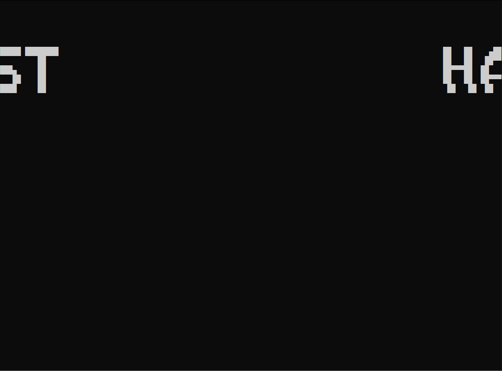

# Ghosthaus ver 1.2 - in development

## Version goals:
- Rewrite most of the code from scratch so it's easily maintainable and readable
- Address the problem of massive memory leaks
- Handle terminal resizing elegantly
- Change game mechanics for the benefit of the game
- Add new features

 

## Progress:

 

 

29.06.2023

- [x] Create wrappers for ncurses library and ncurses windows to take advantage of C++ class destructors and eliminate memory leaks caused by ncurses
- [x] Begin implementing the proper "Master" controller hierarchy
- [x] Design the system in a way that handles terminal resizing at any time
- [x] Redesign the game to be run on a constant, non input related clock
- [x] Create an animated title screen
- [ ] Solve the problem of animated parts of title screen disappearing after terminal resize from too small to acceptable
- [x] Create a sick game intro
- [x] Begin reimplementing the main menu system